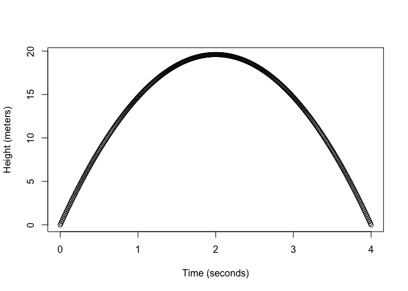

STAT545B – Assignment B1
================
Wangchen Xu

## Exercise1: Make a funtion.

- In this exercise, you’ll be making a function and fortifying it. The
  function need not be complicated. The function need not be “serious”,
  but shouldn’t be nonsense. In this exercise, I create and document a
  simple quadratic function.

``` r
library(roxygen2)
library(testthat)
```

``` r
#' @title 
#' Evaluate a quadratic polynomial function y = a*x^2 + b*x + c
#' @descriptions
#' This function evaluates a quadratic equation given coefficients `a`, `b`, and `c`.
#' It computes the numeric output y for each input value of `x`.
#' The function includes options for handling missing values (na.rm).
#' @param x The input numeric x value.
#' @param a,b,c Numeric scalars in quadratic equation.
#' @param na.rm Logical, whether to remove NA values in `x`. Default set to FALSE.
#' @return The output numeric y values.
#' 
#'
#' @examples
#' quad_fx(2, a = 2, b = 2, c = 2)      # handle single x value
#' quad_fx(2:4)                         # output supposed to be 4 9 16 for y=x^2.
#' quad_fx(1:3, a = -1, b = -1, c = 1)  # we can change values for abc, otherwise they are default.
#' quad_fx(c(1, NA, 3))                 # keep NA, because NA is default set to be FALSE)
#' quad_fx(c(1, NA, 3), na.rm = TRUE)   # remove NA since na is set to be TRUE


#' @export #default for y = x^2
quad_fx <- function(x, a = 1, b = 0, c = 0, na.rm = FALSE) {

if (!is.numeric(x) || !is.null(dim(x))) {stop("`x` must be a numeric vector.")}
if (!is.numeric(a) || length(a) != 1 
    ||!is.numeric(b) || length(b) != 1 
    ||!is.numeric(c) ||length(c)!= 1) {stop("`a`, `b`, and `c` must be numeric scalars.")}

if (isTRUE(na.rm)) x <- x[!is.na(x)]
   
y <- a*x^2 + b*x + c
return(y)
}
```

## Exercise 2: Document your Function.

I have already included documentation in my code, which includes:  
1. Title  
2. Function description: In 1-2 brief sentences, describe what the
function does.  
3. Document each argument with the @param tag, making sure to justify
why you named the parameter as you did.  
4. What the function returns, using the @return tag.  

## Exercise 3: Include examples

Demonstrate the usage of your function with a few examples. Use one or
more new code chunks, describing what you’re doing.  
I would like to give a couple of examples in the following code chunk.  

**Example 1: simple input and NA case**

``` r
quad_fx(2, a = 2, b = 2, c = 2)      # handle single x value
```

    ## [1] 14

``` r
quad_fx(2:4)                         # output supposed to be 4 9 16 for y=x^2.
```

    ## [1]  4  9 16

``` r
quad_fx(1:3, a = -1, b = -1, c = 1)  # we can change values for abc, otherwise they are default.
```

    ## [1]  -1  -5 -11

``` r
quad_fx(c(1, NA, 3))                 # keep NA, because NA is default set to be FALSE)
```

    ## [1]  1 NA  9

``` r
quad_fx(c(1, NA, 3), na.rm = TRUE)   # remove NA since na is set to be TRUE
```

    ## [1] 1 9

**Example 2: Acceleration problems**  
We can use this function to simulate the height of a ball thrown
upwards, and we can even plot a graph to see if y value (the height) has
its maximum when velocity = 0. The graph should be a very good looking
parabola.  

With an initial velocity = 19.6 m/s, and initial height = 0 m.  The
acceleration a is the gravity of earth, which is -9.8 m/s^2.  
The highest point supposed to be t = 2s because I made up the initial
speed to be 4 \* acceleration.  

``` r
time <- seq(0, 4, by = 0.01)  # set time range to be [0,4], time interval 0.01 s
height <- quad_fx(time, a = -4.9, b = 19.6, c = 0)
plot(time, height, xlab = "Time (seconds)", ylab = "Height (meters)")
```

<!-- -->

## Exercise 4: Test the Function

Running examples is a good way of checking by-eye whether your function
is working as expected. But, having a formal “yes or no” check is useful
when you move on to other parts of your analysis.

``` r
test_that("the quadratic function works", {
  expect_equal(quad_fx(0:4), c(0, 1, 4, 9, 16))
  expect_equal(quad_fx(c(1,NA,3)), c(1, NA, 9))
  expect_equal(quad_fx((c(1,NA,3)), na.rm = TRUE), c(1, 9))
  expect_length(quad_fx((c(1,NA,NA)), na.rm = TRUE), 1L)
})
```

    ## Test passed 🎉
